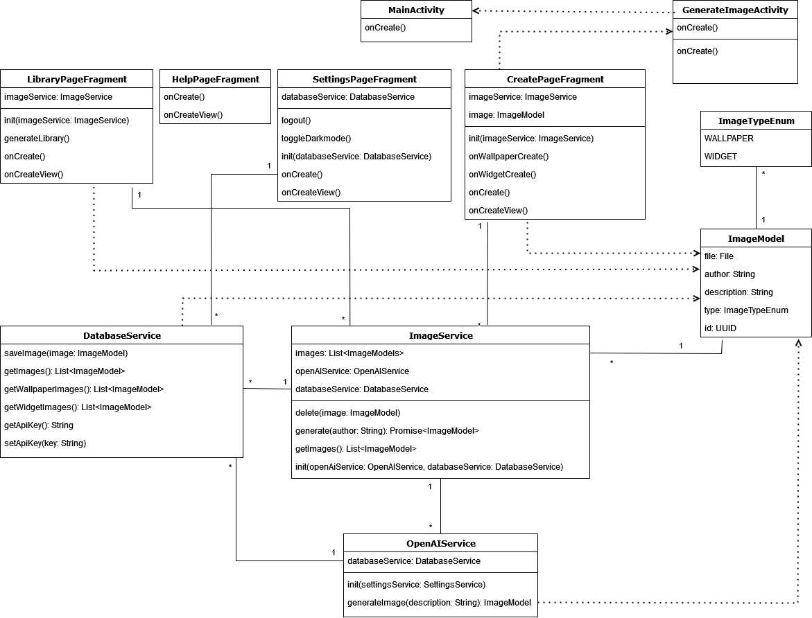

# WallpaperAI

  <image src="./app/src/main/res/mipmap-xxhdpi/ic_launcher_round.webp" width="144" /> 
  
<b>WallpaperAI</b> Create your personal Wallpapers & Widgets!

## Planning

### Class Diagram

This was the class diagram in the planning phase. I have noticed that there are a few things that I've missed and that should be adjusted.

- *The `LoginActivity` is missing*  
  The login activity should be connected with the main activity. The activity should be startable in the create fragment or the settings fragment. Depends from where the user is coming.
